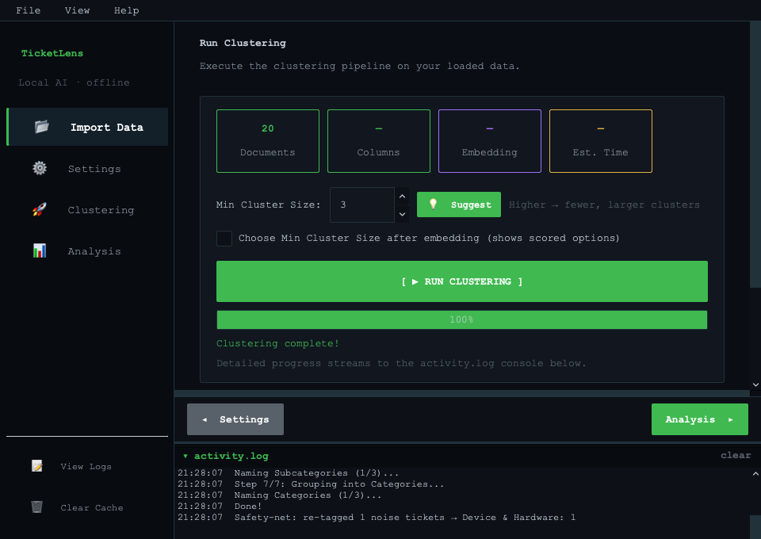
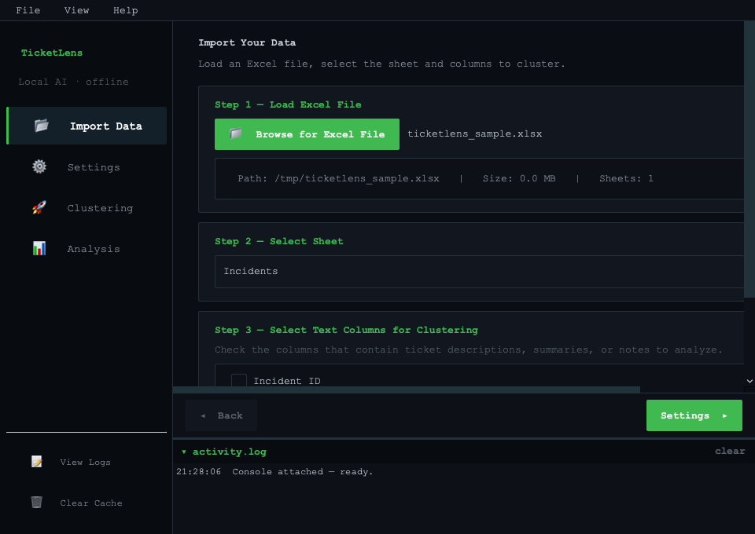
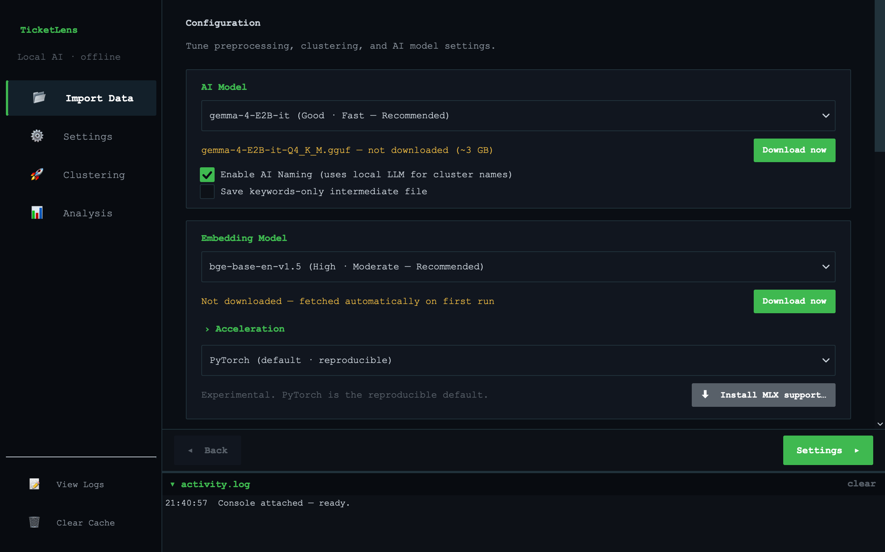
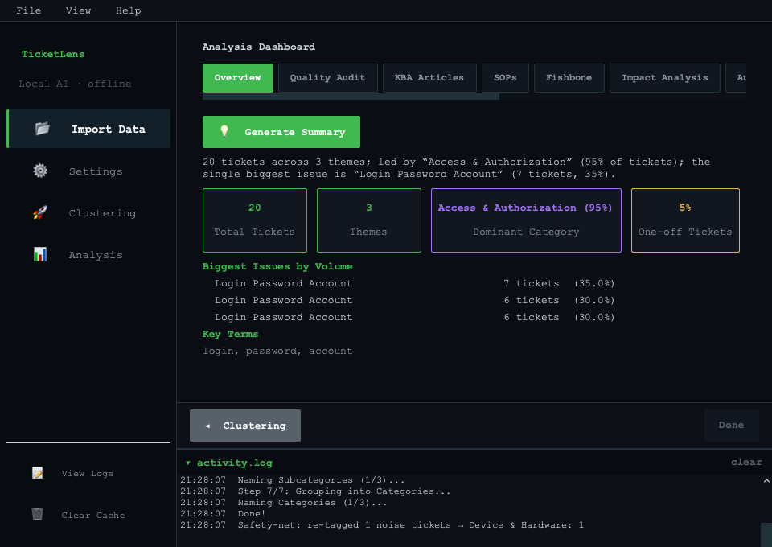
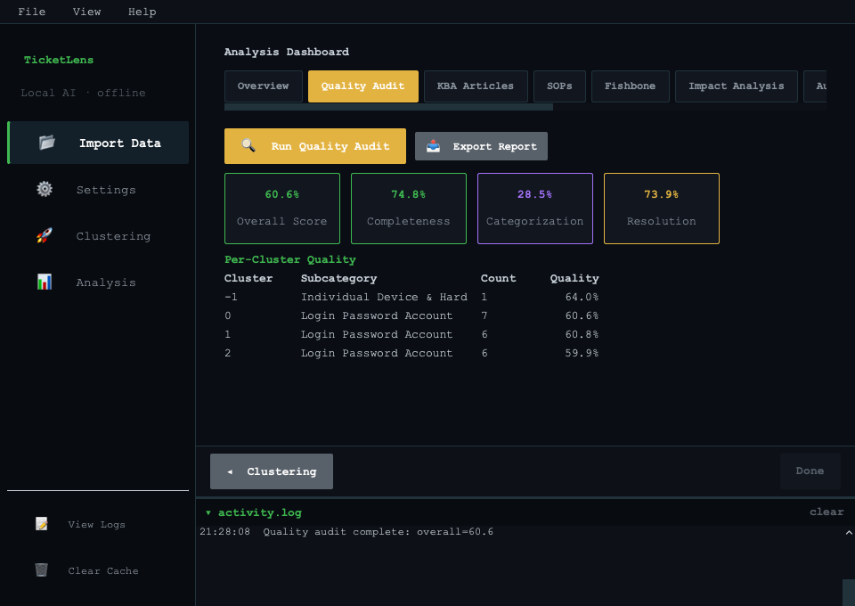
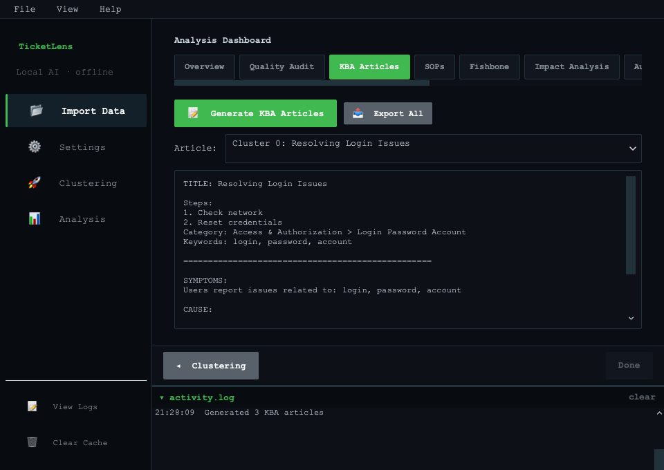
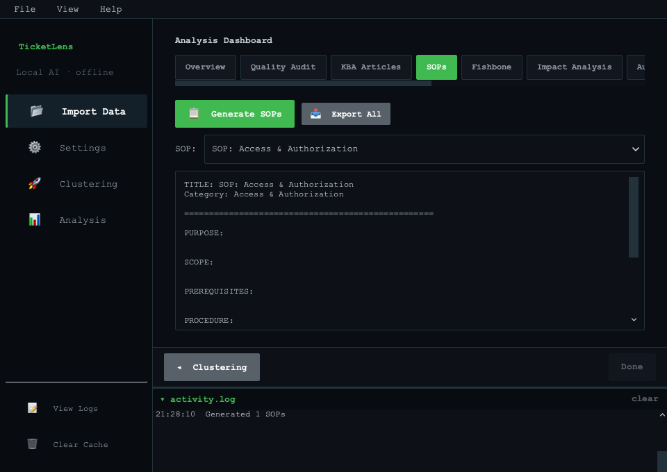
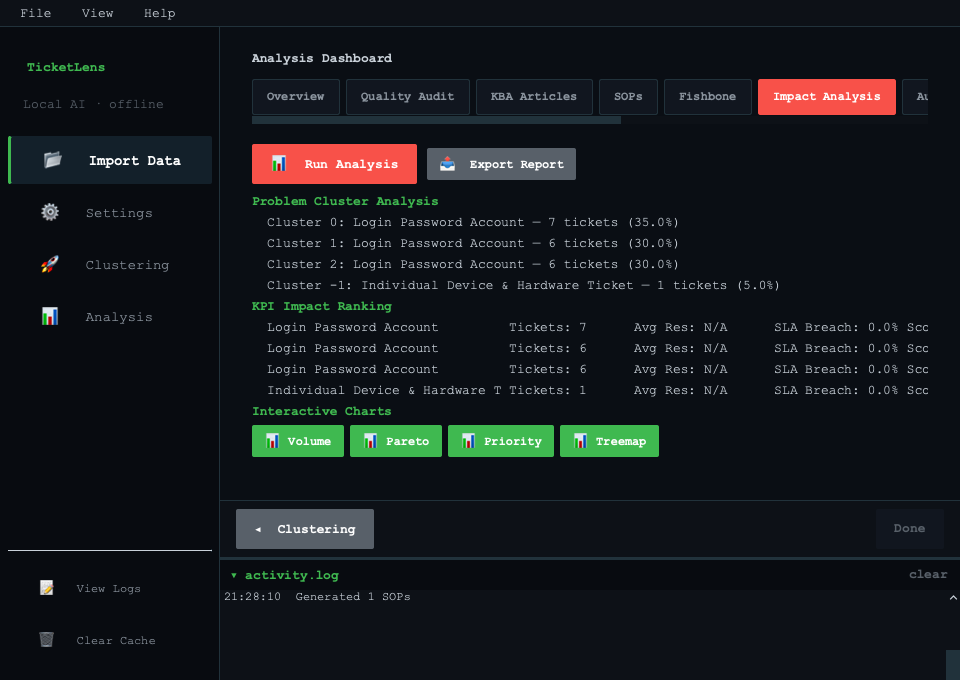
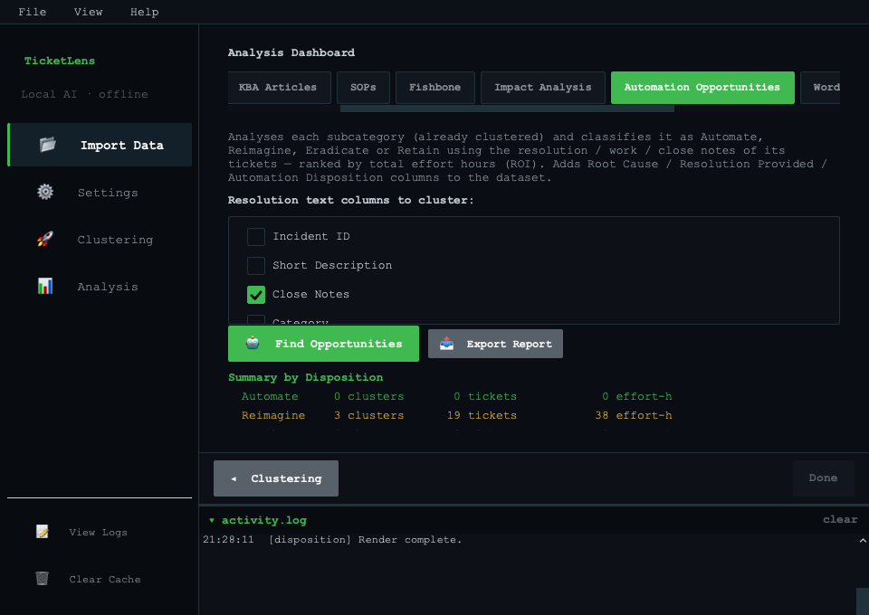
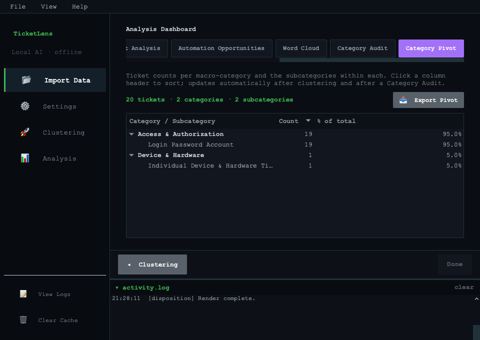

# TicketLens

[](https://github.com/AneekHait/TicketLens/actions/workflows/ci.yml)
[](LICENSE)
[](https://www.python.org/downloads/)
[](#installation)

**TicketLens** — a privacy-first desktop app that uses local AI to cluster IT support tickets (or any text data) into meaningful groups and surface insights (labels, KBAs, SOPs, audits). Your ticket data stays on your machine; the only outbound traffic is a one-time download of the AI models from Hugging Face on first run.

<p align="center">
  
</p>

## Features
- **Local & private:** Clustering and inference run offline on your CPU — your ticket data never leaves your machine. (AI models download once, on first run.)
- **Semantic Clustering:** Groups tickets by meaning, not just keywords, with an interactive Min Cluster Size picker that lets you tune granularity after embedding.
- **AI Labeling:** Uses a local LLM (Gemma 4, Phi-4-mini, Qwen2.5, or any instruct GGUF with an embedded chat template) to generate human-readable cluster names and categories. Curated models download on first use.
- **Quality Audit:** Scores tickets for completeness, categorization, and resolution quality; exports a per-cluster breakdown workbook.
- **Knowledge Base Articles & SOPs:** Generates KBA and SOP drafts for each cluster using the local LLM.
- **Impact Analysis:** Identifies the highest-volume pain points and estimates time-to-resolve.
- **Fishbone Diagrams:** Classifies cluster keywords into Ishikawa cause categories and renders interactive diagrams in the browser.
- **Automation Opportunities:** Scores clusters for automation/self-service potential using heuristics and LLM analysis.
- **Category Audit:** Proposes re-categorization of clusters that look inconsistent with their peers.
- **Category Pivot:** Cross-tabulates categories against subcategories with ticket counts, exportable to Excel.
- **Word Cloud Studio:** Generates per-cluster or global word clouds with configurable stopwords.
- **Customizable:** Column mapping, preprocessing toggles, stopword lists, embedding models, and clustering parameters are all user-configurable and persist across sessions.

## Installation

### Quick start (Windows)

Double-click **`run.bat`**. On first run it verifies you have a supported Python,
creates a local `.venv`, installs the pinned dependencies (with prebuilt CPU
`llama.cpp` wheels), runs a one-time per-machine AI-engine health check, and
launches the app. If the folder is copied to another machine, `run.bat` detects
the stale `.venv` and rebuilds it automatically.

### Quick start (macOS and Linux)

```bash
./run.sh              # first run sets everything up, then launches
./run.sh --rebuild    # discard .venv and reinstall from scratch
```

`run.sh` is the counterpart to `run.bat` and does the same work: it finds a
supported Python, creates and repairs `.venv`, installs the pinned dependencies
from the prebuilt CPU wheel index, health-checks the local LLM engine once per
machine, and launches. If it is not executable yet, run `chmod +x run.sh`.

Platform notes:

| Platform | llama.cpp engine |
|---|---|
| Linux x86_64 / arm64 (glibc or musl) | Prebuilt wheel |
| macOS Apple Silicon | Prebuilt wheel |
| macOS Intel (x86_64) | **Compiled from source** — needs `xcode-select --install` |

There is no prebuilt `llama-cpp-python` wheel for macOS Intel at the pinned
version, so `run.sh` builds it and tells you so before it starts. Everywhere else
it refuses a silent source build, to turn a missing wheel into a clear error
rather than a surprise twenty-minute compile.

On a minimal or headless Linux image, PySide6 needs Qt's system libraries, which
pip does not install. `run.sh` checks for this on first run and prints the exact
`apt`/`dnf` command if they are missing.

### Manual install

1.  **Install Python 3.11–3.14** (3.12 recommended, 64-bit). `pandas 3.x` requires 3.11+.
2.  **Install dependencies** into a virtual environment (`run.bat` / `run.sh` do
    this for you; these steps are for a manual setup):
    ```bash
    python -m pip install -r requirements.txt \
      --extra-index-url https://abetlen.github.io/llama-cpp-python/whl/cpu --only-binary llama-cpp-python
    ```
    - `requirements.txt` pins the direct dependencies to the tested set.
    - For a **byte-exact** environment (every transitive package pinned, Python 3.14),
      install `requirements.lock` instead of `requirements.txt`.
    - For tests: `python -m pip install -r requirements-dev.txt`.

    *Note: the `--extra-index-url` above supplies a prebuilt CPU wheel for
    `llama-cpp-python`, so no C++ compiler is normally needed. If a model fails to
    load on your CPU (Windows error `0xc000001d`), run `repair_llm.ps1` to rebuild
    the engine for your CPU's instruction set.*

3.  **Download a Model (optional, auto-downloaded on first use):**
    The app auto-downloads a curated default model on first run. If you prefer a
    specific GGUF, place it in the `models/` folder (or any path) and select it in
    Settings → AI Model. Any instruct GGUF with an embedded chat template works
    (Gemma, Phi-4, Qwen, Llama-3) — the app uses the model's own chat template automatically.

## Usage & Visual Walkthrough

### 1. Load Data & Column Mapping
Select an Excel (`.xlsx` / `.xls`) workbook, choose the incident worksheet, and check the text fields to analyze (e.g. *Short Description*, *Resolution Notes*). TicketLens automatically cleans boilerplates, URLs, emails, and sensitive identifiers locally.

<p align="center">
  
</p>

### 2. Configure AI Models & Hardware Acceleration
Pick your local LLM and embedding model. Choose your preferred acceleration:
- **PyTorch (default · reproducible)**: Reference CPU implementation.
- **Apple Metal / MPS**: Direct Apple GPU acceleration for embeddings on macOS.
- **MLX (Apple Silicon · experimental)**: 1-click install via the **Install MLX support…** button (or `./install_mlx.sh`).
- **OpenVINO INT8 (Windows/Linux)**: 1-click install via **Install OpenVINO support…** (or `install_openvino.bat`).

<p align="center">
  
</p>

### 3. Run Semantic Clustering
Click **RUN CLUSTERING**. TicketLens embeds tickets into semantic vector space, reduces dimensions with UMAP, clusters with HDBSCAN, and names each cluster with the local LLM.

<p align="center">
  
</p>

### 4. Analysis Dashboard & Actionable Insights
Explore deep analysis across 10 specialized modules:

<p align="center">
  
</p>

<details>
<summary><b>🔍 View Deep Analysis Modules (Quality Audit, KBAs, SOPs, Impact, Automation)</b></summary>

#### Quality Audit
Score ticket completeness, categorization accuracy, and resolution documentation across all clusters with one-click Excel export.
<p align="center">
  
</p>

#### Knowledge Base Articles (KBAs) & Standard Operating Procedures (SOPs)
Generate actionable, structured KBA articles and standard procedures directly from incident resolution patterns.
<p align="center">
  
</p>
<p align="center">
  
</p>

#### Impact Analysis & Bottlenecks
Identify top incident volume drivers, business impact, and resolution bottlenecks.
<p align="center">
  
</p>

#### Automation & Self-Service Opportunities
Evaluate disposition potential (*Automate, Reimagine, Eradicate, Retain*) and projected ROI hours saved.
<p align="center">
  
</p>

#### Category Pivot Hierarchy
Cross-tabulate high-level categories and granular subcategories with interactive counts and percentages.
<p align="center">
  
</p>

</details>

## Apple Silicon acceleration

On an arm64 Mac the two slow steps — embedding every ticket, and LLM labelling —
can both run on the GPU. **Most of this needs no extra install:**

| Step | Backend | How to enable |
|---|---|---|
| LLM labelling | llama.cpp **Metal** | Automatic. `run.sh` installs the Metal wheel on arm64. |
| Embeddings | PyTorch **MPS** | Settings → Acceleration → *"Apple Metal / MPS"* |
| Either | **MLX** (experimental) | Settings → *"Install MLX support…"*, or `./install_mlx.sh` |

`run.sh` picks the Metal `llama.cpp` build automatically on Apple Silicon (the
CPU wheel index also has an arm64 wheel, but it is compiled without Metal, so
GPU offload would silently do nothing). PyTorch MPS needs nothing installed —
`torch` already ships it — and falls back to CPU per model if it hits an
unsupported op.

### MLX (optional, experimental)

MLX is a separate Apple GPU engine. Install it only if you want to try it:

```bash
./install_mlx.sh
```

Then choose *"MLX (Apple Silicon · experimental)"* under Acceleration for
embeddings, and/or an `MLX · …` entry under AI Model for labelling.

Two things to know:

- **The MLX embedding backend is verified numerically before it is used.** On
  load it embeds a small sample with both MLX and PyTorch and compares direction
  (cosine) *and* magnitude. If they disagree it is refused and PyTorch runs
  instead — because the curated models do not all L2-normalise and clustering
  uses euclidean distance, so a mismatched backend would quietly change your
  clusters rather than raise an error. Only a short allowlist of models is
  eligible at all.
- **`mlx-embeddings` is GPL-3.0**, unlike `mlx` and `mlx-lm` (MIT). It is not
  bundled with TicketLens — `install_mlx.sh` fetches it into your own `.venv`
  and asks first. See [NOTICE](NOTICE).

## Optional: OpenVINO acceleration (experimental)

On Intel CPUs with VNNI (DL Boost — most Intel chips since ~2019), OpenVINO **INT8**
quantization makes embedding generation roughly **3.6–4.2× faster** for BERT-family
models (bge-*, gte-*, MiniLM) and Qwen3-Embedding, at ~0.998 cosine similarity.
Clustering *quality* is preserved, but exact cluster assignments shift slightly more than
a random-seed change — so **PyTorch remains the default and the reproducible reference**;
OpenVINO is opt-in.

To enable it:
1. Run `install_openvino.bat` once (it installs into the existing `.venv`). This adds the
   OpenVINO stack without changing your `transformers` version (the optimum packages are
   installed `--no-deps`).
2. Restart the app, then under **Embedding Model → Acceleration** pick
   *"OpenVINO INT8 (CPU)"*. The first run builds a one-time quantized model (~30 s–2 min,
   cached under `models/embedding/_ov/`); later runs reuse it.

Notes: not supported for EmbeddingGemma (stays on PyTorch); requires a turnkey-compatible
model; falls back to PyTorch automatically if anything goes wrong.

## Troubleshooting
- **"llama-cpp-python" install fails:** You may need Visual Studio Build Tools (Windows) or Xcode (Mac). Alternatively, try:
  `pip install llama-cpp-python --extra-index-url https://abetlen.github.io/llama-cpp-python/whl/cpu`
- **OpenVINO option greyed out / "not installed":** run `install_openvino.bat`, then restart.


## Contributing

Contributions are welcome. Start with [CONTRIBUTING.md](CONTRIBUTING.md) — it covers
the dev setup, the architecture rules the tests enforce, and a list of traps that have
each cost real debugging time.

Two things worth knowing before you open a PR:

- Run `powershell -ExecutionPolicy Bypass -File check.ps1` (ruff + pytest). CI runs the
  same two checks.
- **Never commit ticket data.** Spreadsheets, `.csv`, `.docx` and `.tsz` sessions are
  gitignored for a reason — they contain real support tickets.

Bugs and feature requests go to
[GitHub Issues](https://github.com/AneekHait/TicketLens/issues). Security
vulnerabilities should be reported privately — see [SECURITY.md](SECURITY.md).

This project follows the [Contributor Covenant](CODE_OF_CONDUCT.md).

## Privacy

TicketLens is offline by design:

- Your ticket data never leaves your machine. Clustering, embedding and LLM inference
  all run locally on your CPU.
- There is **no telemetry and no analytics** — not even opt-in.
- The only outbound network traffic is the one-time download of AI models from
  Hugging Face on first use. After that the app runs with no network at all.

## License

Licensed under the [Apache License 2.0](LICENSE).

Third-party dependencies and their licenses are listed in [NOTICE](NOTICE). Note that
the AI models downloaded at runtime are **not** covered by this project's license and
carry their own terms — check the model card before commercial or regulated use.

## Author

Built by **Aneek Hait** — [aneekhait.github.io](https://aneekhait.github.io) ·
[GitHub](https://github.com/AneekHait) ·
[LinkedIn](https://www.linkedin.com/in/aneekhait/)
